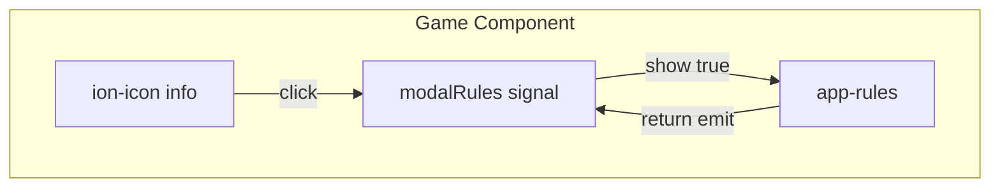

# Tela de Regras do Jogo - Componente Rules

## Contexto

O projeto é um app Angular/Ionic para o RPG de mesa "Armas e Arcanos". O estilo visual usa:

- **Fonte:** MedievalSharpBook
- **Cores:** `#f7d7a8` (texto/primary), fundo escuro `rgba(35, 35, 35, 0.95)`
- **Padrão de modal:** overlay escuro + card centralizado (story-selector, decision-modal)

As regras extraídas do [Regras.pdf](Regras.pdf) cobrem 10 seções principais: Introdução, Componentes, Criação de Personagens, Vida/Morte/Descanso, Combate, Tipos de Encontros, Classes e Habilidades, Tesouros e Itens, Estrutura de Monstros e Regras Especiais.

---

## Arquitetura da Implementação




---

## 1. Criar o Componente Rules

**Localização:** `src/app/game-components/rules/`

### 1.1 `rules.component.ts`

- Mesmo padrão do [story-selector/story-selector.ts](src/app/game-components/story-selector/story-selector.ts): `@Input() show: boolean`, `@Output() return = new EventEmitter<void>()`
- Método `close()` que emite no `return`
- Dados das regras em estrutura tipada (interface ou array) para facilitar manutenção

### 1.2 `rules.component.html`

- **Overlay:** `*ngIf="show"` com classe `story-screen-overlay` (igual ao story-selector)
- **Card principal:** `ion-card` scrollável com:
  - Header: título "Regras do Jogo" + botão fechar (ícone `close-circle-outline`)
  - `ion-content` com scroll para o conteúdo extenso
  - Seções com: `ion-icon` + título + descrição (parágrafos/lists)
  - Estrutura por seção baseada no PDF

**Seções e ícones sugeridos (Ionic):**


| Seção                        | Ícone                   |
| ---------------------------- | ----------------------- |
| Introdução                   | `book-outline`          |
| Componentes                  | `layers-outline`        |
| Criação dos Personagens      | `people-outline`        |
| Vida, Morte e Descanso       | `heart-outline`         |
| Combate                      | `flash-outline`         |
| Tipos de Encontros           | `map-outline`           |
| Classes e Habilidades        | `sparkles-outline`      |
| Tesouros e Itens             | `gift-outline`          |
| Monstros: estrutura da carta | `card-outline`          |
| Regras Especiais             | `document-text-outline` |


### 1.3 `rules.component.less`

- Reutilizar variáveis de [story-selector.less](src/app/game-components/story-selector/story-selector.less) e [game.less](src/app/game-components/game.less) (decision-modal)
- `--background`, `--color`, `--border-radius`, `font-family: MedievalSharpBook`
- Estilização das seções: espaçamento, ícones alinhados, hierarquia visual (títulos vs descrição)
- Card com `max-height` e `overflow` para scroll em telas pequenas

---

## 2. Integrar no Game Component

### 2.1 [game.ts](src/app/game-components/game.ts)

- Importar o componente `Rules`
- Adicionar `Rules` ao array `imports` do `@Component`
- Criar signal `modalRules = signal(false)`
- Métodos `openRules()` e `closeRules()` (ou handler `rulesClosed()`)

### 2.2 [game.html](src/app/game-components/game.html)

- Incluir `<app-rules [show]="modalRules()" (return)="closeRules()">` (logo após `app-story-selector`)
- No bloco `*ngIf="dice() == 0 && selectedCard() == '' && !hasStorySelected()"` (linhas 49–54), adicionar o botão de regras na `story-view`:
  - Novo `ion-icon` com `name="information-circle-outline"` e `(click)="openRules()"`
  - Manter o `story-btn` (book) e colocar os dois ícones lado a lado (flex horizontal)

### 2.3 [game.less](src/app/game-components/game.less)

- Estilizar o novo ícone de regras para manter o mesmo tamanho e cor do `#story-btn` (ex.: dentro de `.story-view`)

---

## 3. Conteúdo das Regras (baseado no PDF)

Estrutura de cada seção:

```
[ícone] Título da Seção
Descrição em parágrafos e/ou listas
```

Conteúdo resumido a ser incluído:

- **Introdução:** Descrição do jogo, duração (~40min–1h), sem mestre fixo
- **Componentes:** Fichas, baralhos (monstros, chefes, tesouros), cartas de classes, campanhas, D20, papel e lápis
- **Criação de Personagens:** Classe aleatória (Curandeiro, Mago, Guerreiro, Ladino), nível 1–10, +1 nível por encontro, 20 PV iniciais, +2 PV/nível
- **Vida, Morte e Descanso:** PV, morte em 0, descanso restaura PV e permite troca de itens
- **Combate:** D20 para quantidade de monstros (÷2 para 4 jogadores, ÷4 para 2), máx. 10/5 monstros, acerto D20 ≥ 10
- **Tipos de Encontros:** Cenários (Selva, Cidades, Montanhas, Cavernas, Mortos-Vivos)
- **Classes e Habilidades:** Teste D20 ≥ 10 para habilidades
- **Tesouros e Itens:** D20 ímpar → 1 item, par → 2 itens, troca apenas em descanso
- **Monstros:** PV, Ataque, Defesa, Efeito; exemplo do Zumbi Lento
- **Regras Especiais:** Monstros que roubam itens, testes descritos na carta

---

## 4. Considerações de UX

1. **Scroll:** Usar `ion-content` com scroll nativo para muitas seções
2. **Acessibilidade:** Títulos com hierarquia semântica (h2/h3)
3. **Responsividade:** Card com `width: 80%` / `max-width: 500px` como nos outros modais
4. **Fechamento:** Overlay clicável pode fechar (opcional); botão fechar garantido

---

## Arquivos a Criar/Modificar


| Ação      | Arquivo                                                        |
| --------- | -------------------------------------------------------------- |
| Criar     | `src/app/game-components/rules/rules.component.ts`             |
| Criar     | `src/app/game-components/rules/rules.component.html`           |
| Criar     | `src/app/game-components/rules/rules.component.less`           |
| Modificar | `src/app/game-components/game.ts` (import, signal, handlers)   |
| Modificar | `src/app/game-components/game.html` (app-rules, botão info)    |
| Modificar | `src/app/game-components/game.less` (se necessário para ícone) |
